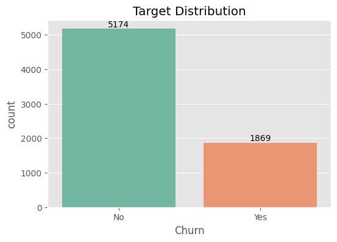
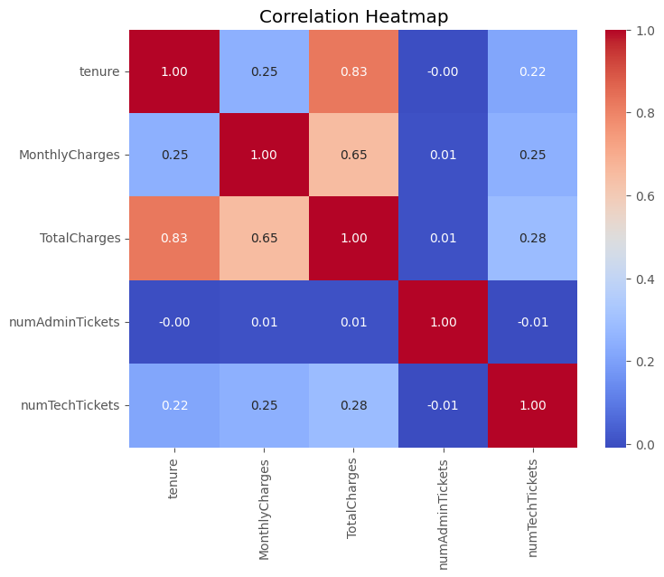
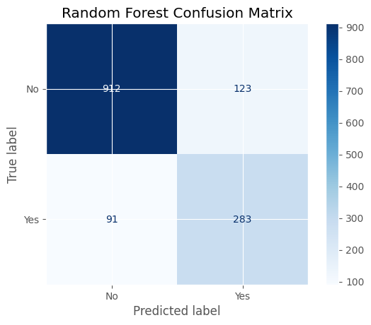
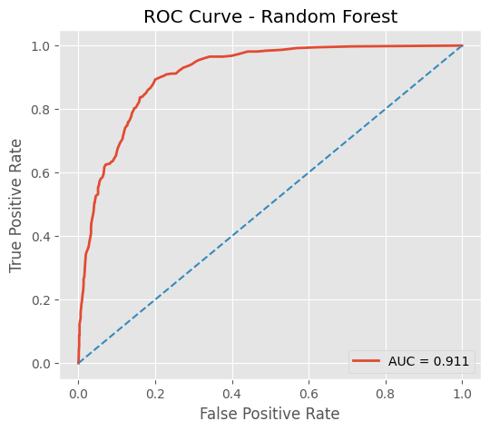
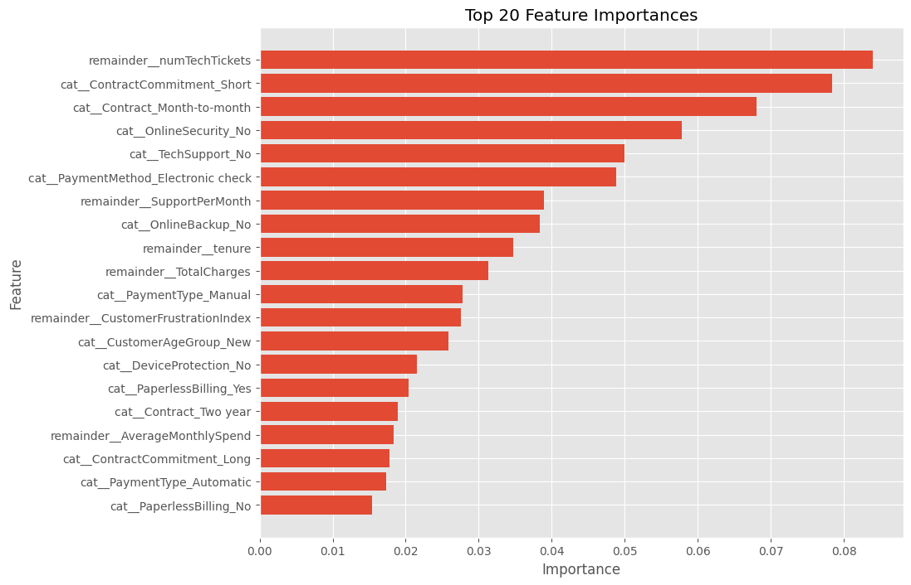
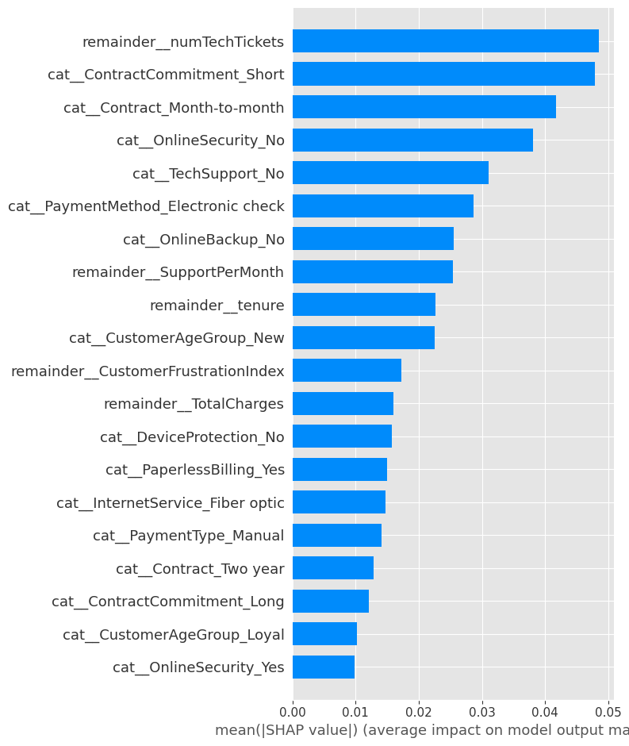

#  Telecom Customer Churn Prediction using Machine Learning

Predicting customer churn is one of the most impactful business applications of machine learning. In the telecom industry, acquiring a new customer is significantly more expensive than retaining an existing one. This project develops an end-to-end churn prediction pipeline that not only identifies customers likely to churn but also explains *why* they are at risk and recommends actionable retention strategies.
# Repository Structure

| File/Folder                                   | Description                                   |
| --------------------------------------------- | --------------------------------------------- |
|  `images/`                                  | EDA and model visualization plots             |
|  `End_to_end_Churn_Analysis_Workflow.ipynb` | Complete end-to-end Analysis, modelling and predicting workflow |
|  `README.md`                                | Project overview and documentation            |
|  `Telecom Churn Rate Dataset.csv`           | Original raw telecom dataset                  |
|  `requirements.txt`                         | Required Libraries and platforms                     |
|  `telecom_customer_churn_cleaned.csv`       | Cleaned and preprocessed dataset              |

#  Table of Contents

- Project Overview
- Business Problem
- Dataset
- Project Workflow
- Exploratory Data Analysis
- Feature Engineering
- Model Development
- Model Performance
- Feature Importance
- SHAP Explainability
- Business Recommendations
- Repository Structure
- Tech Stack
- Future Improvements

#  Project Overview

The objective of this project is to predict customer churn using supervised machine learning while uncovering the key behavioral, financial, contractual, and support-related factors influencing customer retention.

Unlike traditional churn prediction notebooks, this project combines:

- Comprehensive Exploratory Data Analysis
- Hypothesis-driven business analysis
- Custom feature engineering
- Class imbalance handling using SMOTE
- Hyperparameter tuning
- Explainable AI using SHAP
- Business-oriented recommendations

#  Business Problem

Customer churn represents revenue loss, increased acquisition costs, and reduced customer lifetime value.

Instead of identifying customers after they leave, telecom companies can proactively detect customers at risk of churn and intervene with personalized retention strategies.

This project aims to answer:

- Which customers are most likely to churn?
- What factors contribute the most to churn?
- How can churn be reduced through business actions?

#  Dataset

**Dataset Size**

- Customers: **7,043**
- Original Features: **23**
- Engineered Features: **10**
- Final Features Used: **31**

**Target Variable**

- Churn
    - Yes
    - No

#  Project Workflow

Data Audit & Cleaning
        ↓
Exploratory Data Analysis
        ↓
Feature Engineering
        ↓
Feature Selection
        ↓
Data Preprocessing
        ↓
SMOTE
        ↓
Baseline Models
        ↓
Random Forest
        ↓
Hyperparameter Tuning
        ↓
Feature Importance
        ↓
SHAP Explainability
        ↓
Business Recommendations

#  Exploratory Data Analysis

The EDA focused on validating business hypotheses and discovering customer behavior patterns.

### Key Insights

- Senior citizens exhibited a higher churn rate than younger customers.
- Customers without partners or dependents were more likely to churn.
- Customers on month-to-month contracts had the highest churn.
- Higher monthly charges increased churn probability.
- Customers with shorter tenure were significantly more likely to leave.
- Fiber optic customers churned more frequently than DSL users.
- Online Security and Tech Support services substantially reduced churn.
- Electronic check users showed the highest churn among payment methods.
- Technical support tickets showed a strong positive relationship with churn.
- Multiple technical tickets indicated severe customer dissatisfaction.

#  Feature Engineering

To improve model performance and capture customer behavior more effectively, several new features were engineered.

| Feature | Description |
|----------|-------------|
| CustomerFrustrationIndex | Total customer support interactions (Admin + Technical Tickets) |
| ServiceAdoptionScore | Number of subscribed telecom services |
| CustomerAgeGroup | Customer tenure grouped into age segments |
| MonthlyChargeCategory | Monthly spending category |
| LifetimeValueCategory | Total spending category |
| PaymentType | Automatic vs Manual payments |
| ContractCommitment | Long-term vs Short-term commitment |
| TicketSeverity | Support issue severity |
| SupportPerMonth | Support frequency normalized by tenure |
| AverageMonthlySpend | TotalCharges ÷ Tenure |

These engineered variables capture customer engagement, support burden, loyalty, and spending behavior beyond the original dataset.

#  Model Development

Models Evaluated

- Logistic Regression
- Decision Tree
- Random Forest

Final Model

**Random Forest Classifier**

Enhancements:

- One-Hot Encoding
- Feature Engineering
- SMOTE Oversampling
- Hyperparameter Tuning using RandomizedSearchCV

#  Model Performance

| Metric | Baseline Random Forest | Final Random Forest |
|---------|----------------------:|--------------------:|
| Accuracy | 83.68% | **84.81%** |
| Precision | 70.69% | **69.70%** |
| Recall | 65.78% | **75.67%** |
| F1 Score | 68.14% | **72.56%** |
| ROC-AUC | 0.911 | **0.915** |

### Performance Improvement

The tuned Random Forest achieved:

- Higher Recall (+10%)
- Higher F1 Score
- Better ROC-AUC
- Improved ability to identify customers likely to churn

#  Feature Importance

The trained Random Forest identified the most influential predictors of customer churn.

#  SHAP Explainability

SHAP was used to explain both global and individual model predictions.

The SHAP analysis highlighted:

- Contract Type
- Tenure
- Monthly Charges
- Customer Frustration Index
- Tech Support
- Online Security

as the strongest contributors to churn prediction.

#  Business Recommendations

Based on model insights, the following strategies are recommended:

- Prioritize customers with high Customer Frustration Index.
- Improve technical support resolution times.
- Encourage migration from month-to-month to long-term contracts.
- Promote Online Security and Tech Support add-ons.
- Provide personalized retention offers to high-value customers.
- Closely monitor new customers during their first year.
- Encourage automatic payment methods.
- Deploy the model as an early warning churn monitoring system

#  Tech Stack

Programming

- Python

Libraries

- Pandas
- NumPy
- Matplotlib
- Seaborn
- Scikit-learn
- SHAP
- imbalanced-learn

Development Environment

- Google Colab
- Git
- GitHub
  
#  Future Improvements

- Deploy using Streamlit
- Build a real-time churn prediction dashboard
- Compare with XGBoost, and LightGBM 
- Integrate customer feedback and call-center transcripts
- Develop automated retention recommendation engine

#  Author

**Ritika Kumari**

Integrated M.Tech, Geophysical Technology  
Indian Institute of Technology Roorkee

Interested in Machine Learning, Data Analytics, Product Analytics and AI-driven Business Solutions.

If you found this project interesting, consider giving the repository a star.
